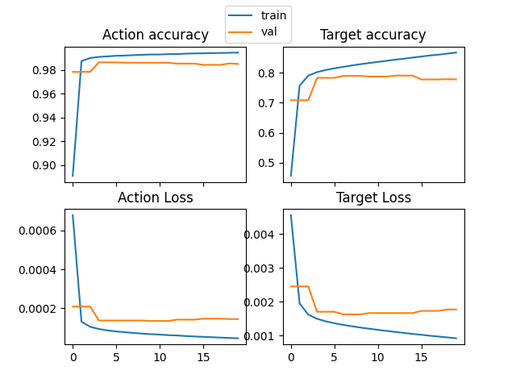
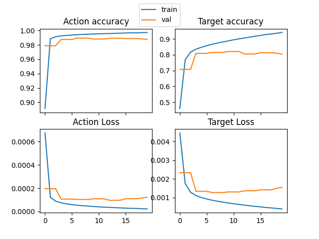
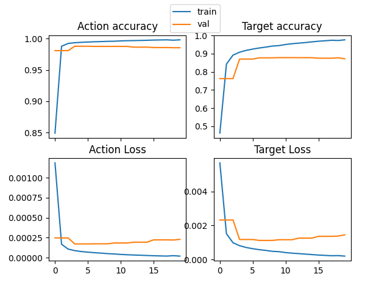
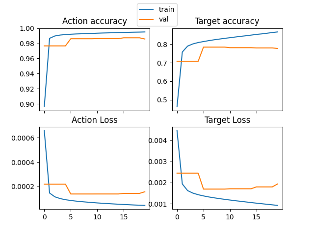
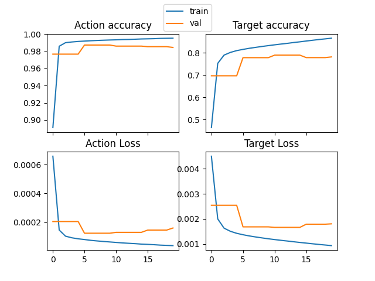
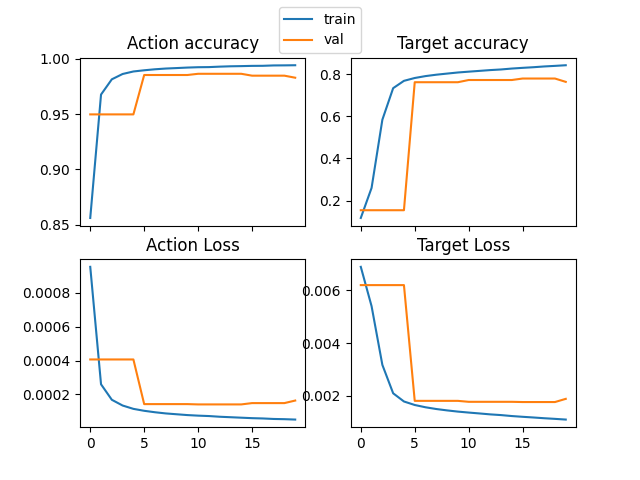
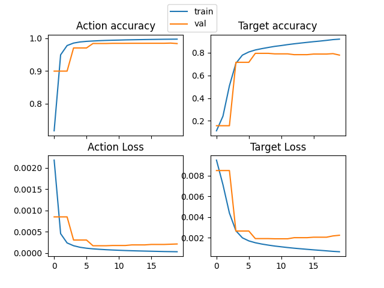

# Homework-1 Report
Author: Athang Gupte
Date: Sep-09-2022

## Models:
## 1. `lstm`
Base architecture with embedding matrix followed by RNN with LSTM units and two fully connected output heads for actions and targets respectively
### Architecture
- Inputs
    - dynamic padding - padded length set to max length in a mini-batch
    - no limit on max length
- Embedding layer
    - dimension: 200
        - selected by trial and error
        - tested 100, 150 and 200
        - validation accuracy using 200 was 5% more than 100
- LSTM RNN layer
    - dimension: 200
        - selected by trial and error
        - tested 100, 150 and 200
    - inputs: embeddings for complete padded sequence
    - single layer, single direction
        - default choice
    - input is packed using `pack_padded_sequence` utility function
        - docs and forums suggest packing the sequence before passing to the LSTM for performance in training loop on GPUs
- Fully Connected layer for Actions
    - inputs: last hidden state output of LSTM layer
    - shape: `(lstm_hidden_size = 200, output_size = 8)`
    - gives the output weights for actions
    - activation: Linear
        - cross entropy loss converts to logits internally
- Fully Connected layer for Actions
    - inputs: last hidden state output of LSTM layer
    - shape: `(lstm_hidden_size = 200, output_size = 80)`
    - gives the output weights for targets
    - activation: Linear

## 2. `act-tar`
Same as the base architecture but output of ACTION is fed into the fully connected layer for TARGET along with the LSTM output
### Architecture
- Inputs
    - dynamic padding - padded length set to max length in a mini-batch
    - no limit on max length
- Embedding layer
    - dimension: 200
- LSTM RNN layer
    - dimension: 200
    - single layer, single direction
    - input is packed using `pack_padded_sequence` utility function
- Fully Connected layer for Actions
    - inputs: last hidden state output of LSTM layer
    - shape: `(lstm_hidden_size = 200, output_size = 8)`
    - gives the output weights for actions
    - activation: Linear
- Fully Connected layer for Targets
    - inputs: last hidden state of LSTM concatenated with output of actions
    - shape: `(lstm_hidden_size = 200 + 8, output_size = 80)`
    - gives the output weights for targets
    - activation: Linear

## 3. `tar-act`
Same as the base architecture but output of TARGET is fed into the fully connected layer for ACTION along with the LSTM output
### Architecture
- Inputs
    - dynamic padding - padded length set to max length in a mini-batch
    - no limit on max length
- Embedding layer
    - dimension: 200
- LSTM RNN layer
    - dimension: 200
    - single layer, single direction
    - input is packed using `pack_padded_sequence` utility function
- Fully Connected layer for Targets
    - inputs: last hidden state output of LSTM layer
    - shape: `(lstm_hidden_size = 200, output_size = 80)`
    - gives the output weights for targets
    - activation: Linear
- Fully Connected layer for Actions
    - inputs: last hidden state of LSTM concatenated with output of targets
    - shape: `(lstm_hidden_size = 200 + 80, output_size = 8)`
    - gives the output weights for actions
    - activation: Linear

## 4. `attn`
In the base architecture, another LSTM layer and an attention layer are added on top of the LSTM layer. The attention weights are multiplied with the first LSTM's outputs and then fed into the second LSTM with the 
### Architecture
- Inputs
    - fixed length padding: padded length is fixed to 2 standard deviations more than the mean length - 95% coverage (default behaviour)
    - sequences greater than max length are cut off
- Embedding layer
    - dimension: 200
- LSTM RNN layer #1
    - dimension: 200
    - single layer, single direction
    - input is packed using `pack_padded_sequence` utility function and output is padded using `pad_packed_sequence` utility function
- Attention layer
    - inputs: at every timestep, the output of the first LSTM layer is concatenated with the embedding of the input for that timestep
    - outputs: at every timestep, the output is a vector of weights corresponding to each of the LSTM's output heads
    - shape: `(embedding_dim + lstm_hidden_size = 200 + 200, max_seq_len)`
        - `max_seq_len` is 24 for the training dataset
    - this layer learns the weights to apply to each output of the previous LSTM layer based on the input embedding of the current timestep and the current output of the LSTM - which words to pay more attention to
- Attention application
    - the attention weights are multiplied with the previous LSTM's output sequence to "apply attention" to the sequence
    - uses `torch.bmm` - batch-wise matrix-matrix multiplication
- LSTM RNN layer #2
    - dimension: 200
    - inputs: attention-applied sequential outputs of previous LSTM
    - single later, single direction
    - input is packed using `pack_padded_sequence` utility function
- Fully Connected layer for Targets
    - inputs: last hidden state of LSTM
    - shape: (lstm_hidden_size = 200, output_size = 80)
    - gives the output weights for targets
    - activation: Linear
- Fully Connected layer for Actions
    - inputs: last hidden state of LSTM
    - shape: (lstm_hidden_size = 200, output_size = 8)
    - gives the output weights for actions
    - activation: Linear

## Data Inputs
4 types of inputs created and 3 of them were tested over various models. (Check [Metrics](#metrics)).
1. `curr` - only current instruction
2. `prev` - last and current instruction
3. `next` - current and next instruction
4. `prev-next` - last, current and next instructions (not tested as the input size was too large to complete training in viable time)

The [Analysis](#analysis) section talks about the effect of these input formats on the accuracy of the predictions in validation

## Metrics
Every model was trained for 20 epochs, with emb_dim=200 and lstm_dim=200 and with batch size of 512
### Training set
| model | input data | final ACTION accuracy | final TARGET accuracy | log file |
|--|--|--|--|--|
| `lstm` | `curr` | 99.47% | 86.73% | [lstm-run-1.log](saved_logs/lstm-run-1.log) |
| `lstm` | `prev` | 99.73% | 94.05% | [prev-lstm-run-1.log](saved_logs/prev-lstm-run-1.log) |
| `lstm` | `next` | 99.81% | 97.60% | [next-lstm-run-1.log](saved_logs/next-lstm-run-1.log) |
| `act-tar` | `curr` | 99.51% | 86.58% | [act-tar-run-1.log](saved_logs/act-tar-run-1.log) |
| `tar-act` | `curr` | 99.54% | 86.52% | [tar-act-run-1.log](saved_logs/tar-act-run-1.log) |
| `attn` | `curr` | 99.43% | 84.34% | [attn-run-1.log](saved_logs/attn-run-1.log) |
| `attn` | `prev` | 99.69% | 92.03% | [prev-attn-run-1.log](saved_logs/prev-attn-run-1.log) |

### Validation set
| model | input data | final ACTION accuracy | final TARGET accuracy | max ACTION accuracy | max TARGET accuracy |
|--|--|--|--|--|--|
| `lstm` | `curr` | 98.52% | 77.80% | 98.65% | 79.06% |
| `lstm` | `prev` | 98.77% | 80.41% | 98.94% | 82.03% |
| `lstm` | `next` | 98.55% | 87.19% | 98.78% | 87.79% |
| `act-tar` | `curr` | 98.57% | 77.65% | 98.73% | 78.40% |
| `tar-act` | `curr` | 98.45% | 78.14% | 98.73% | 78.92% |
| `attn` | `curr` | 98.30% | 76.43% | 98.65% | 78.02% |
| `attn` | `prev` | 98.34% | 77.96% | 98.48% | 79.51% |

\* _max accuracy_ is the maximum accuracy logged on the __*validation*__ set across training and not the final accuracy at the end of training

## Training Graphs
### 1. `lstm` + `curr`

### 2. `lstm` + `prev`

### 3. `lstm` + `next`

### 4. `act-tar` + `curr`

### 5. `tar-act` + `curr`

### 6. `attn` + `curr`

### 7. `attn` + `prev`

## Analysis:
All the models (using only the current instruction as input) get stuck around 78-82 % accuracy for predicting the targets in the validation set.  
I studied a few cases in which the `lstm` model got the predictions wrong.

One pattern I found frequently in the dataset was that the same input has multiple different outputs in different examples.

There are a lot of examples in the dataset which contain target information that cannot be inferred with high accuracy due to confounding examples/distribution.
For example:
    - "table" in the input sentence can mean "diningtable", "coffeetable", "sidetable" or "countertop". This information is confounding unless given a visual cue.
    - Similarly, "knife" can mean "knife" or "butterknife" based on the context.

The simple LSTM model does not have enough contextual information to infer and differentiate between the options in most cases. The model that was given data with previous instruction augmented to the current one shows a little better performance but not much. This might be since in a lot of cases, the previous and the current sentences both refer to the objects in the same manner.

The performance is much better when the next instruction is appended to the current one rather than the previous one. in many cases, the intention or use case of the target object in question is made clear in the next instruction and this might be the reason that the model is able to infer more accurately in this case.

There is still room for improvement. Since the ALFRED task is made for language and vision both as input, the additional information must be extracted from the visual input.

#### For commands to execute the training loop of the above experiments check [models.md](models/models.md)
